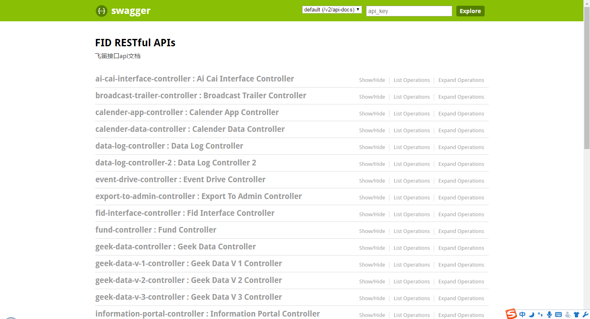
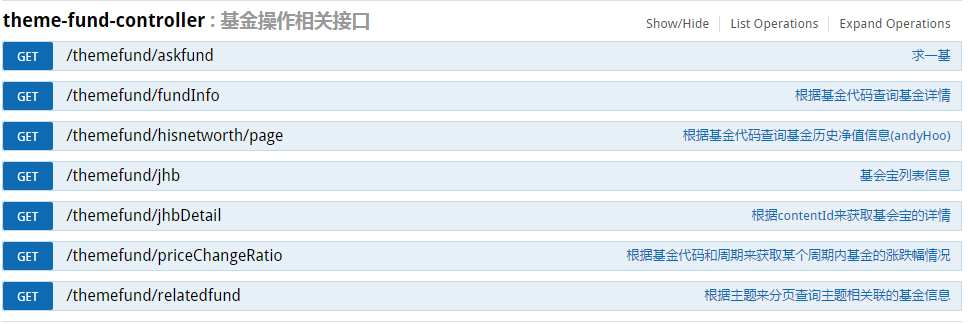
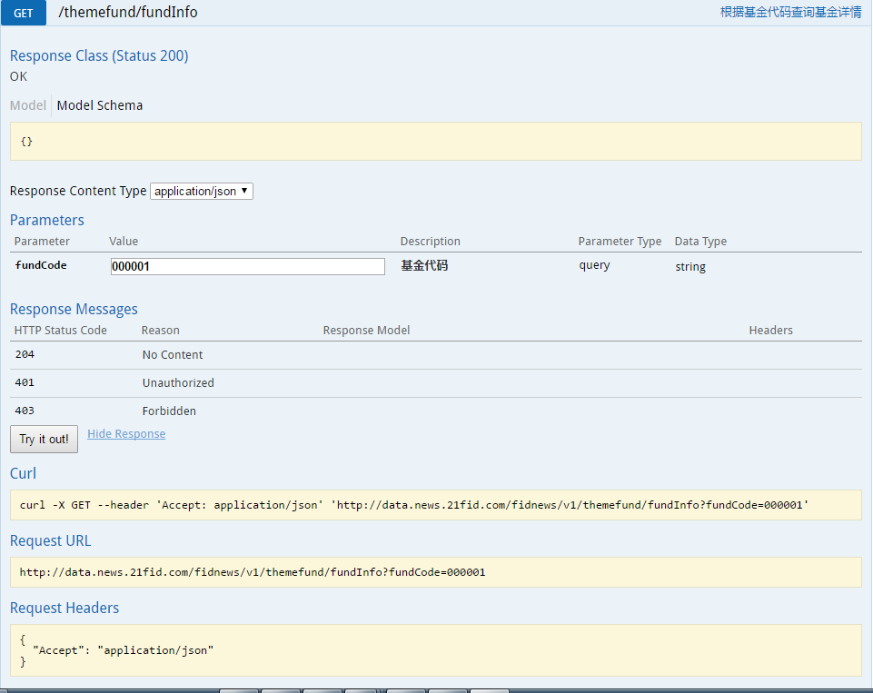

#  Spring MVC中使用 Swagger2 构建Restful API
>**Swagger** is a powerful **open source framework** backed by a large ecosystem of tools that helps you design, build, document, and consume your **RESTful APIs**.
>
>官网：[http://swagger.io/](http://swagger.io/)

1. 添加swagger2相关依赖：
``` java
		<!--swagger2,springmvc中间包-->
		<dependency>
			<groupId>com.mangofactory</groupId>
			<artifactId>swagger-springmvc</artifactId>
			<version>1.0.2</version>
		</dependency>
		<!--swagger2包-->
		<dependency>
			<groupId>io.springfox</groupId>
			<artifactId>springfox-swagger2</artifactId>
			<version>2.4.0</version>
		</dependency>
		<!--swagger2生成web界面需要的包,swagger1需要导入页面相关的js,css,html,swagger2为了简化操作直接将这些打包这个包中-->
		<dependency>
			<groupId>io.springfox</groupId>
			<artifactId>springfox-swagger-ui</artifactId>
			<version>2.4.0</version>
		</dependency>
		<!--swagger2依赖的包-->
		<dependency>
			<groupId>com.fasterxml.jackson.core</groupId>
			<artifactId>jackson-annotations</artifactId>
			<version>2.8.3</version>
		</dependency>
		<dependency>
			<groupId>com.fasterxml.jackson.core</groupId>
			<artifactId>jackson-databind</artifactId>
			<version>2.8.3</version>
		</dependency>
		<dependency>
			<groupId>com.fasterxml.jackson.core</groupId>
			<artifactId>jackson-core</artifactId>
			<version>2.8.3</version>
		</dependency>
```

2.添加swagger2配置类
``` java
package com.hw.config;

import org.springframework.context.annotation.Bean;
import org.springframework.context.annotation.Configuration;
import org.springframework.web.servlet.config.annotation.EnableWebMvc;

import springfox.documentation.builders.ApiInfoBuilder;
import springfox.documentation.builders.PathSelectors;
import springfox.documentation.builders.RequestHandlerSelectors;
import springfox.documentation.service.ApiInfo;
import springfox.documentation.service.Contact;
import springfox.documentation.spi.DocumentationType;
import springfox.documentation.spring.web.plugins.Docket;
import springfox.documentation.swagger2.annotations.EnableSwagger2;

@EnableWebMvc
@Configuration
@EnableSwagger2
public class SwaggerConfig {
	@Bean
	public Docket createRestApi() {
		return new Docket(DocumentationType.SWAGGER_2).apiInfo(apiInfo())
				.select()
				// 扫描特定的包下面的注解
				.apis(RequestHandlerSelectors.basePackage("com.hw.control"))
				.paths(PathSelectors.any()).build();
	}

	private ApiInfo apiInfo() {
		return new ApiInfoBuilder()
				.title("Swagger2 RESTful APIs")
				.description("swagger2,springmvc构建restful风格api")
				.termsOfServiceUrl("https://github.com/AndyHooo")
				.contact(
						new Contact("AndyHoo",
								"https://github.com/AndyHooo",
								"396877565@qq.com")).version("1.0").build();
	}
}
```

3.在springmvc配置文件中增加自动扫描swagger2的配置
```
<!-- 使用 Swagger Restful API文档时，添加此注解 -->
<mvc:default-servlet-handler />
<mvc:annotation-driven/>
```
或者
```
<mvc:resources location="classpath:/META-INF/resources/" mapping="swagger-ui.html"/>
<mvc:resources location="classpath:/META-INF/resources/webjars/" mapping="/webjars/**"/>
```
4.在springmvc的controller中添加swagger2相关的api注解：
``` java
package com.hw.control;

import javax.servlet.http.HttpServletRequest;

import org.springframework.stereotype.Controller;
import org.springframework.web.bind.annotation.RequestMapping;
import org.springframework.web.bind.annotation.RequestMethod;
import org.springframework.web.bind.annotation.RequestParam;
import org.springframework.web.bind.annotation.ResponseBody;

import com.hw.entity.Result;
import com.hw.entity.User;
import com.wordnik.swagger.annotations.Api;
import com.wordnik.swagger.annotations.ApiParam;
import com.wordnik.swagger.annotations.ApiResponse;

import io.swagger.annotations.ApiOperation;

@Api(value = "User控制器")
@Controller
@RequestMapping("/user")
public class UserController {
	@ApiOperation(value = "根据用户id查询用户信息", httpMethod = "GET", produces = "application/json")
	@ApiResponse(code = 200, message = "success", response = Result.class)
	@ResponseBody
	@RequestMapping(value = "/queryUserById", method = RequestMethod.GET, produces = "application/json")
	public Result queryUserById(
			@ApiParam(name = "userId", required = true, value = "用户Id")
			@RequestParam("userId") int userId, HttpServletRequest request) {
		User user = new User(userId, "andyhoo", 24);
		Result result = new Result();
		result.setCode(0);
		result.setData(user);
		result.setMessage("success");
		return result;
	}
}

```
5.通过web页面来查看apidoc:[查看样例http://47.92.0.76/ptccservice/swagger-ui.html](http://47.92.0.76:80/ptccservice/swagger-ui.html)

6.swagger2常用注解：
####springfox、swagger.annotations.*注解部分参数介绍
- @ApiIgnore 忽略注解标注的类或者方法，不添加到API文档中

- @ApiOperation 展示每个API基本信息
	value api名称
	notes 备注说明
- @ApiImplicitParam 用于规定接收参数类型、名称、是否必须等信息

    name 对应方法中接收参数名称
    value 备注说明
	required 是否必须 boolean
	paramType 参数类型 body、path、query、header、form中的一种
	body 使用@RequestBody接收数据 POST有效
	path 在url中配置{}的参数
	query 普通查询参数 例如 ?query=q ,jquery ajax中data设置的值也可以，例如 {query:”q”},springMVC中不需要添加注解接收
	header 使用@RequestHeader接收数据
	form 笔者未使用，请查看官方API文档
	dataType 数据类型，如果类型名称相同，请指定全路径，例如 dataType = “java.util.Date”，springfox会自动根据类型生成模型
- @ApiImplicitParams 包含多个@ApiImplicitParam
- @ApiModel 定义controller请求参数中的封装类型
- @ApiModelProperty 对模型中属性添加说明，例如 上面的PageInfoBeen、BlogArticleBeen这两个类中使用，只能使用在类中。
	value 参数名称
	required 是否必须 boolean
	hidden 是否隐藏 boolean
	其他信息和上面同名属性作用相同，hidden属性对于集合不能隐藏，目前不知道原因
- @ApiParam 对单独某个参数进行说明，使用在类中或者controller方法中都可以。注解中的属性和上面列出的同名属性作用相同


dataweb示例（基金相关操作接口：com.fid.controller.ThemeFundController）：
  
``` java  
package com.fid.controller;

import java.math.BigDecimal;
import java.text.SimpleDateFormat;
import java.util.ArrayList;
import java.util.Date;
import java.util.HashMap;
import java.util.HashSet;
import java.util.LinkedList;
import java.util.List;
import java.util.Map;
import java.util.Set;

import javax.annotation.Resource;

import org.joda.time.DateTime;
import org.jsoup.Jsoup;
import org.jsoup.nodes.Document;
import org.jsoup.nodes.Element;
import org.jsoup.select.Elements;
import org.springframework.stereotype.Controller;
import org.springframework.web.bind.annotation.ModelAttribute;
import org.springframework.web.bind.annotation.RequestMapping;
import org.springframework.web.bind.annotation.RequestMethod;
import org.springframework.web.bind.annotation.RequestParam;
import org.springframework.web.bind.annotation.ResponseBody;

import com.aicai.appmodel.domain.result.ModelResult;
import com.aicai.appmodel.domain.result.PageResult;
import com.aicai.appmodel.page.DataPage;
import com.ytwl.cms.content.common.domain.CmsContent1;
import com.ytwl.cms.content.common.domain.CmsContentTxt;
import com.ytwl.cms.content.common.domain.CmsTopic;
import com.ytwl.cms.content.common.service.CmsContentService;
import com.ytwl.cms.content.common.service.CmsContentTxtService;
import com.ytwl.cms.content.common.service.CmsTopicService;
import com.ytwl.cms.content.common.vo.CmsContentQueryVo;
import com.ytwl.cms.themefund.common.domain.AskFundReason;
import com.ytwl.cms.themefund.common.domain.AskFundResult;
import com.ytwl.cms.themefund.common.domain.AssetAllocation;
import com.ytwl.cms.themefund.common.domain.CmsJhb;
import com.ytwl.cms.themefund.common.domain.FundGeneralSituation;
import com.ytwl.cms.themefund.common.domain.FundManager;
import com.ytwl.cms.themefund.common.domain.FundPostionDetail;
import com.ytwl.cms.themefund.common.domain.FundReturnRate;
import com.ytwl.cms.themefund.common.domain.FundSectorAllocation;
import com.ytwl.cms.themefund.common.domain.HisNetWorth;
import com.ytwl.cms.themefund.common.domain.HssbHisTrade;
import com.ytwl.cms.themefund.common.domain.ThemeFundTag;
import com.ytwl.cms.themefund.common.service.AskFundReasonService;
import com.ytwl.cms.themefund.common.service.AskFundResultService;
import com.ytwl.cms.themefund.common.service.AssetAllocationService;
import com.ytwl.cms.themefund.common.service.CmsJhbService;
import com.ytwl.cms.themefund.common.service.FundGeneralSituationService;
import com.ytwl.cms.themefund.common.service.FundManagerService;
import com.ytwl.cms.themefund.common.service.FundPostionDetailService;
import com.ytwl.cms.themefund.common.service.FundReturnRateService;
import com.ytwl.cms.themefund.common.service.FundSectorAllocationService;
import com.ytwl.cms.themefund.common.service.FundTypeService;
import com.ytwl.cms.themefund.common.service.HisNetWorthService;
import com.ytwl.cms.themefund.common.service.HssbHisTradeService;
import com.ytwl.cms.themefund.common.service.ThemeFundCodeService;
import com.ytwl.cms.themefund.common.service.ThemeFundTagService;
import com.ytwl.cms.themefund.common.service.ThemeMatchDegreeService;

import io.swagger.annotations.Api;
import io.swagger.annotations.ApiOperation;
import io.swagger.annotations.ApiParam;
import io.swagger.annotations.ApiResponse;
import net.sf.json.JSONArray;
import net.sf.json.JSONObject;
import springfox.documentation.annotations.ApiIgnore;

@Api(value="themefund",description = "基金操作相关接口")
@Controller
@RequestMapping("/themefund")
public class ThemeFundController {
	
	@Resource(name = "hisNetWorthService")
	private HisNetWorthService hisNetWorthService;
	
	@Resource(name = "fundGeneralSituationService")
	private FundGeneralSituationService fundGeneralSituationService;
	
	@Resource(name = "themeMatchDegreeService")
	private ThemeMatchDegreeService themeMatchDegreeService;
	
	@Resource(name = "fundTypeService")
	private FundTypeService fundTypeService;
	
	@Resource(name = "themeFundTagService")
	private ThemeFundTagService themeFundTagService;
	
	@Resource(name = "fundReturnRateService")
	private FundReturnRateService fundReturnRateService;
	
	@Resource(name = "fundManagerService")
	private FundManagerService fundManagerService;
	
	@Resource(name = "assetAllocationService")
	private AssetAllocationService assetAllocationService;
	
	@Resource(name = "fundSectorAllocationService")
	private FundSectorAllocationService fundSectorAllocationService;
	
	@Resource(name = "fundPostionDetailService")
	private FundPostionDetailService fundPostionDetailService;
	
	@Resource(name = "themeFundCodeService")
	private ThemeFundCodeService themeFundCodeService;
	
	@Resource(name = "hssbHisTradeService")
	private HssbHisTradeService hssbHisTradeService;
	
	@Resource(name = "askFundResultService")
	private AskFundResultService askFundResultService;
	
	@Resource(name = "askFundReasonService")
	private AskFundReasonService askFundReasonService;
	
	@Resource(name = "cmsContentService")
	private CmsContentService cmsContentService;
	
	@Resource(name = "cmsTopicService")
	private CmsTopicService cmsTopicService;
	
	@Resource(name = "cmsContentTxtService")
	private CmsContentTxtService cmsContentTxtService;
	
	@Resource(name = "cmsJhbService")
	private CmsJhbService cmsJhbService;
	
	
    /**
     * @Description 获取历史净值列表
     * @param fundCode 基金代码
     * @param page 分页信息
     * @return
     */
	@ApiOperation(value = "根据基金代码查询基金历史净值信息(andyHoo)", httpMethod = "GET", produces = "application/json")
	@ApiResponse(code = 200, message = "success", response = JSONObject.class)
    @RequestMapping(value= "/hisnetworth/page",method = RequestMethod.GET, produces = "application/json")
	@ResponseBody
    public JSONObject page(
    		@ApiParam(name = "fundCode", required = true, value = "基金代码")@RequestParam(name="fundCode")String fundCode,
    		@ModelAttribute DataPage<HisNetWorth> page) {
    	JSONObject resultJson = new JSONObject();
    	SimpleDateFormat sdf = new SimpleDateFormat("yyyy-MM-dd");
    	if(fundCode==null||fundCode.equals("")){
    		resultJson.put("code", "-1");
    		resultJson.put("msg", "基金代码不能为空");
    		resultJson.put("data", "");
    	}
    	else{
    		PageResult<HisNetWorth> pageResult = hisNetWorthService.page(fundCode, page);
    		DataPage<HisNetWorth> dataPage = pageResult.getPage();
    		List<HisNetWorth> dataList = dataPage.getDataList();
    		
    		//获取基金名称
    		FundGeneralSituation generalSituation = fundGeneralSituationService.queryByCode(fundCode);
    		String fundsFullName = generalSituation.getFundsFullName();
    		
    		JSONArray jsonArray = new JSONArray();
    		for(HisNetWorth hisNetWorth : dataList){
    			JSONObject jsonObject = new JSONObject();
    			
    			//日期
    			Date date = hisNetWorth.getDate();
    			String dateStr = sdf.format(date);
    			jsonObject.put("date", dateStr);
    			
    			//单位净值
    			Double unitNet = hisNetWorth.getUnitNet();
    			jsonObject.put("unitNet",unitNet);
    			
    			//累计净值
    			Double acNet = hisNetWorth.getAcNet();
    			jsonObject.put("acNet",acNet);
    			
    			//日增长率
    			Double dailyIncrRate = hisNetWorth.getDailyIncrRate();
    			String dailyIncrRateStr = "";
    			if(dailyIncrRate>0){
    				dailyIncrRateStr = "+"+ dailyIncrRate;
    			}
    			else{
    				dailyIncrRateStr = dailyIncrRate.toString();
    			}
    			dailyIncrRateStr = dailyIncrRateStr + "%";
    			
    			jsonObject.put("dailyIncrRate",dailyIncrRateStr);
    			
    			jsonArray.add(jsonObject);
    			
    		}
    		
    		resultJson.put("code", "0");
    		resultJson.put("msg", "数据请求成功");
    		resultJson.put("fundcode", fundCode);
    		resultJson.put("name", fundsFullName);
    		resultJson.put("data", jsonArray);
    		resultJson.put("num", jsonArray.size());
    		
    	}
		return resultJson;
        
    }
    
    /**
     * @Description 查询关联基金
     * @param topic 主题
     * @return
     */
	@ApiOperation(value= "根据主题来分页查询主题相关联的基金信息",httpMethod = "GET",produces = "application/json")
	@ApiResponse(code = 200,message = "success",response = JSONObject.class)
    @RequestMapping(value = "/relatedfund",method = RequestMethod.GET,produces = "application/json")
   	@ResponseBody
    public JSONObject relatedFund(
    		@ApiParam(name = "topic",value="主题名称",required=true)@RequestParam(name= "topic")String topic,
    		@ApiParam(name = "pageNo",value = "页码")@RequestParam(name = "pageNo")Integer pageNo,
    		@ApiParam(name = "pageSize",value = "每页大小")@RequestParam(name = "pageSize")Integer pageSize){
    	JSONObject resultJson = new JSONObject();
    	JSONArray jsonArray = new JSONArray();
    	if(topic == null || topic.equals("")){
    		resultJson.put("code","-1");
    		resultJson.put("msg", "主题不能为空");
    		resultJson.put("data", "");
    	}
    	else{
    		Map<String, Object> codeAndMatchDegree = themeMatchDegreeService.queryByTopic(topic,pageNo,pageSize);
    		
    		@SuppressWarnings("unchecked")
			List<String> fundCodes = (List<String>) codeAndMatchDegree.get("fundCodes");
    		Integer total = themeMatchDegreeService.countPage(topic);
    		for(String fundCode : fundCodes){
    			JSONObject jsonObject = new JSONObject();
    			FundGeneralSituation generalSituation = fundGeneralSituationService.queryByCode(fundCode);
    			HisNetWorth hisNetWorth = hisNetWorthService.queryLatestByCode(fundCode);
    			
    			String fundsFullName = generalSituation.getFundsAbbr();
    			Double unitNet = hisNetWorth.getUnitNet();
    			Double dailyIncrRate = hisNetWorth.getDailyIncrRate();
    			Double matchDegree = (Double) codeAndMatchDegree.get(fundCode); 
    			
    			jsonObject.put("fundCode", fundCode);
    			jsonObject.put("name", fundsFullName);
    			jsonObject.put("unitNet", unitNet);
    			String dailyIncrRateStr = "";
    			if(dailyIncrRate>0){
    				dailyIncrRateStr = "+" + dailyIncrRate;
    			}
    			else{
    				dailyIncrRateStr = dailyIncrRate.toString();
    			}
    			dailyIncrRateStr = dailyIncrRateStr + "%";
    			jsonObject.put("dailyIncrRate", dailyIncrRateStr);
    			jsonObject.put("matchDegree", matchDegree+"%");
    			
    			jsonArray.add(jsonObject);
    		}
    		
    		resultJson.put("code", "0");
    		resultJson.put("msg", "数据请求成功");
    		resultJson.put("data", jsonArray);
    		resultJson.put("num", jsonArray.size());
    		resultJson.put("total", total);
    	}
    	return resultJson;
    }
    /**
     * @Description 获取基金信息(涨跌幅另做接口)
     * @param fundCode
     * @return
     */
	@ApiOperation(value = "根据基金代码查询基金详情",httpMethod = "GET",produces = "application/json")
	@ApiResponse(code = 200, message = "success",response = JSONObject.class)
    @RequestMapping(value = "/fundInfo")
    @ResponseBody
    public JSONObject fundInfo(@ApiParam(name = "fundCode",value = "基金代码",required = true)@RequestParam(name = "fundCode")String fundCode){
    	JSONObject resultJson = new JSONObject();
    	
    	if(fundCode==null || fundCode.equals("")){
    		resultJson.put("code", "-1");
    		resultJson.put("msg", "基金代码不能为空");
    		resultJson.put("data", "");
    	}
    	else{
    		JSONObject dataJson = new JSONObject();
    		//从基金概况中获取基金的名称、代码、类型、标签
    		FundGeneralSituation generalSituation = fundGeneralSituationService.queryByCode(fundCode);
    		if(generalSituation==null){
    			resultJson.put("code", "-2");
    			resultJson.put("msg", "未找到该基金代码对应的信息");
    			resultJson.put("data","");
    			return resultJson;
    		}
    		String fundsFullName = generalSituation.getFundsFullName();
    		dataJson.put("name", fundsFullName);
    		dataJson.put("fundCode", fundCode);
    		
    		//获取基金类型
    		Map<String, String> fundTypeMap = fundTypeService.queryFundType();
    		String fundTypeCodes = generalSituation.getFundsType();
			String fundsType = "";
			List<String> fundTypeList = new ArrayList<>();
			if(fundTypeCodes!=null&&!fundTypeCodes.equals("")){
				String[] split = fundTypeCodes.split(",");
				for(String typeCode : split){
					fundsType = fundTypeMap.get(typeCode);
					fundTypeList.add(fundsType);
				}
			}
			dataJson.put("fundTypes", fundTypeList);
			
			//获取基金匹配度最高的主题的图片
			String fundTopic = themeMatchDegreeService.queryHighestMatchTopic(fundCode);
			if(fundTopic==null||fundTopic.equals("")){
				dataJson.put("img", "-");
			}
			else{
				CmsTopic cmsTopic = cmsTopicService.queryByTopic(fundTopic);
				if(cmsTopic!=null){
					dataJson.put("img", cmsTopic.getImages());
				}
				else{
					dataJson.put("img", "-");
				}
			}
			
			//获取基金标签
			Set<String> tagSet = new HashSet<>();
			String tags = generalSituation.getTags();
			Map<String, ThemeFundTag> tagsMap = themeFundTagService.queryByType("fund");
	    	if(tags!=null&&!tags.equals("")){
	    		String[] tagsArr = tags.split(",");
	    		for(String tag : tagsArr){
	    			
	    			String[] tgs = tag.split("\\|");
	    			String tgId = tgs[0];
	    			ThemeFundTag fundTag = tagsMap.get(tgId);
	    			String tagName = fundTag.getTagName();
	    			
	    			tagSet.add(tagName);
	    		}
	    	}
	    	dataJson.put("tags", tagSet);
	    	
	    	//涨跌幅,历史净值
	    	HisNetWorth latestNetWorth = hisNetWorthService.queryLatestByCode(fundCode);
	    	Double unitNet = latestNetWorth.getUnitNet();
	    	Double dailyIncrRate = latestNetWorth.getDailyIncrRate();
	    	String dailyIncrRateStr = "";
	    	if(dailyIncrRate>0){
	    		dailyIncrRateStr = "+"+dailyIncrRate;
	    	}
	    	else{
	    		dailyIncrRateStr = dailyIncrRate.toString();
	    	}
	    	
	    	dailyIncrRateStr = dailyIncrRateStr + "%";
	    	dataJson.put("dailyIncrRate", dailyIncrRateStr);
	    	dataJson.put("unitNet",unitNet);
	    	
	    	//获取业绩与排名(类型:股票型(GP)、混合型(HH)、债券型(ZQ)、QDII、货币型(HBJJ))
	    	String rankFundType = "";
	    	Set<String> fundTypeSet = new HashSet<>();
	    	fundTypeSet.add("GP");
	    	fundTypeSet.add("HH");
	    	fundTypeSet.add("ZQ");
	    	fundTypeSet.add("QDII");
	    	fundTypeSet.add("HBJJ");
	    	
	    	for(String type : fundTypeSet){
	    		if(fundTypeCodes.indexOf(type)!=-1){
	    			rankFundType = type;
	    			break;
	    		}
	    	}
	    	
	    	Map<String, String> periodMap = new HashMap<>();
	    	periodMap.put("week", "近一周");
	    	periodMap.put("oneMon", "近一月");
	    	periodMap.put("threeMon", "近三月");
	    	periodMap.put("halfYear", "近半年");
	    	periodMap.put("year", "近一年");
	    	periodMap.put("twoYear", "近两年");
	    	periodMap.put("threeYear", "近三年");
	    	periodMap.put("fourYear", "近四年");
	    	periodMap.put("fiveYear", "近五年");
	    	
	    	List<String> periods = new ArrayList<>();
	    	periods.add("week");
	    	periods.add("oneMon");
	    	periods.add("threeMon");
	    	periods.add("halfYear");
	    	periods.add("year");
	    	periods.add("twoYear");
	    	periods.add("threeYear");
	    	periods.add("fourYear");
	    	periods.add("fiveYear");
	    	
	    	JSONArray rankArray = new JSONArray();
	    	for(String periodType : periods){
	    		JSONObject jsonObject = new JSONObject();
	    		FundReturnRate fundReturnRate = fundReturnRateService.queryByCodeAndPeriod(fundCode, periodType);
	    		if(fundReturnRate!=null){
	    			String rank = fundGeneralSituationService.rank(fundCode, periodType, rankFundType);
		    		
		    		Double returnRate = fundReturnRate.getReturnRate();
		    		returnRate =returnRate * 100;
		    		
		    		String returnRateStr = "";
		    		if(returnRate>0){
		    			returnRateStr = "+"+returnRate;
		    		}
		    		else{
		    			returnRateStr = returnRate.toString();
		    		}
		    		
		    		if(returnRateStr.indexOf(".")!=-1&&returnRateStr.length()>(returnRateStr.indexOf(".")+3)){
		    			returnRateStr = returnRateStr.substring(0, returnRateStr.indexOf(".")+3);
		    		}
		    		
		    		returnRateStr = returnRateStr + "%";
		    		jsonObject.put("date", periodMap.get(periodType));
		    		jsonObject.put("returnRate", returnRateStr);
		    		jsonObject.put("rank", rank);
	    		}
	    		else{
		    		jsonObject.put("date", periodMap.get(periodType));
		    		jsonObject.put("returnRate", "-");
		    		jsonObject.put("rank", "-/-");
	    		}
	    		
	    		
	    		rankArray.add(jsonObject);
	    	}
	    	
	    	dataJson.put("achieveRank", rankArray);
	    	
	    	//基金档案信息
	    	JSONObject docJson = new JSONObject();
	    	
	    	//基金信息
	    	JSONObject fundJson = new JSONObject();
	    	fundJson.put("scale",generalSituation.getAssetSize());
	    	String esDateScale = generalSituation.getEsDateScale();
	    	String esDate = esDateScale.split(" / ")[0];
	    	fundJson.put("esDate", esDate);
	    	String fundsCorp = generalSituation.getFundsCorp();
	    	fundJson.put("fundCompany", fundsCorp);
	    	
	    	//基金经理信息
	    	JSONArray managerJsonArr = new JSONArray();
	    	String managerName = generalSituation.getFundsManager(); //基金经理名称(可能存在多个经理人)
	    	List<String> names = new ArrayList<>();
	    	if(managerName.indexOf("、")!=-1){
	    		String[] split = managerName.split("、");
	    		names = java.util.Arrays.asList(split);
	    	}
	    	else{
	    		names.add(managerName);
	    	}
	    	
	    	for(String name : names){
	    		JSONObject managerJson = new JSONObject(); 
	    		managerJson.put("name", name);
		    	FundManager fundManager = fundManagerService.queryByName(name);
		    	//累计任职时间
		    	String cumTenureTime = "-";
    			//从业年均回报
		    	String repayYearly = "-";
		    	if(fundManager!=null){
		    		cumTenureTime = fundManager.getCumTenureTime();
		    		repayYearly = fundManager.getRepayYearly();
		    	}
		    	
		    	managerJson.put("cumTenureTime", cumTenureTime);
		    	if(repayYearly==null){
		    		repayYearly = "-";
		    	}
		    	managerJson.put("repayYearly", repayYearly);
		    	
		    	managerJsonArr.add(managerJson);
	    	}
	    	
	    	
	    	//资金配置信息
	    	JSONObject allocationJson = new JSONObject();
	    	AssetAllocation assetAllocation = assetAllocationService.queryAllocation(fundCode);
	    	String netBondRatioStr = "-";
	    	String netCashRatioStr = "-";
	    	String netShareRatioStr = "-";
	    	
	    	if(assetAllocation!=null){
	    		Double netBondRatio = assetAllocation.getNetBondRatio();
		    	Double netCashRatio = assetAllocation.getNetCashRatio();
		    	Double netShareRatio = assetAllocation.getNetShareRatio();
		    	netBondRatioStr = netBondRatio + "%";
		    	netCashRatioStr = netCashRatio + "%";
		    	netShareRatioStr = netShareRatio + "%";
	    	}
	    	
	    	
	    	allocationJson.put("share", netShareRatioStr);
	    	allocationJson.put("currency", netCashRatioStr);
	    	allocationJson.put("bond", netBondRatioStr);
	    	
	    	
	    	//股票成分
	    	JSONArray sectorArray = new JSONArray();
	    	List<FundSectorAllocation> sectorAllocations = fundSectorAllocationService.queryByCode(fundCode);
	    	for(FundSectorAllocation fsa : sectorAllocations){
	    		JSONObject jsonObject = new JSONObject();
	    		String industryType = fsa.getIndustryType();
	    		Double netWorthRatio = fsa.getNetWorthRatio();
	    		String netWorthRatioStr = netWorthRatio + "%";
	    		
	    		jsonObject.put("industryType", industryType);
	    		jsonObject.put("netWorthRatio", netWorthRatioStr);
	    		sectorArray.add(jsonObject);
	    	}
	    	
	    	docJson.put("fund", fundJson);
	    	docJson.put("manager", managerJsonArr);
	    	docJson.put("assetAllocation", allocationJson);
	    	docJson.put("sectorAllocation", sectorArray);
	    	
	    	dataJson.put("doc", docJson);
	    	
	    	//相关主题
	    	JSONArray relatedTopicArray = new JSONArray();
	    	List<Map<String, String>> queryTop4 = themeMatchDegreeService.queryTop4(fundCode);
	    	for(Map<String, String> map : queryTop4){
	    		Set<String> keySet = map.keySet();
	    		String topic = "";
	    		for(String key: keySet){
	    			topic = key;
	    		}
	    		JSONObject jsonObject = new JSONObject();
	    		Integer newsId = cmsContentService.queryLatestRelatedNewsId(topic);
	    		jsonObject.put("topic", topic);
	    		String matchDegree = map.get(topic);
	    		if(matchDegree==null)continue;
	    		if(matchDegree!=null&&matchDegree.equals("0.0%"))continue;
	    		if(matchDegree.indexOf("%")!=-1){
	    			String numStr = matchDegree.substring(0,matchDegree.indexOf("%"));
	    			Double num = Double.parseDouble(numStr);
	    			if(num<40)continue;
	    			if(num>100)matchDegree="100%";
	    		}
	    		jsonObject.put("matchDegree", matchDegree);
	    		jsonObject.put("latestNewsId", newsId);
	    		relatedTopicArray.add(jsonObject);
	    	}
	    	dataJson.put("relatedTopic", relatedTopicArray);
	    	
	    	//重仓持股
	    	JSONArray positionArray = new JSONArray();
	    	List<FundPostionDetail> postionDetails = fundPostionDetailService.queryByCode(fundCode);
	    	for(FundPostionDetail fpd : postionDetails){
	    		JSONObject jsonObject = new JSONObject();
	    		String stockName = fpd.getStockName();
	    		Double netWorthRatio = fpd.getNetWorthRatio();
	    		String netWorthRatioStr = netWorthRatio + "%";
	    		jsonObject.put("stockName", stockName);
	    		jsonObject.put("netWorthRatio", netWorthRatioStr);
	    		positionArray.add(jsonObject);
	    	}
	    	dataJson.put("position", positionArray);
	    	
	    	resultJson.put("code", "0");
	    	resultJson.put("msg", "请求数据成功");
	    	resultJson.put("data", dataJson);
    	}
    	return resultJson;
    }
    /**
     * @Description 获取涨跌幅
     * @param fundCode 基金代码
     * @param periodType 阶段类型
     * @return
     */
	@ApiOperation(value = "根据基金代码和周期来获取某个周期内基金的涨跌幅情况",httpMethod = "GET",produces = "application/json")
	@ApiResponse(code = 200,message = "success",response = JSONObject.class)
    @ResponseBody
    @RequestMapping("/priceChangeRatio")
    public JSONObject  priceChangeRatio(
    		@ApiParam(name = "fundCode",value = "基金代码",required = true)@RequestParam(name = "fundCode")String fundCode,
    		@ApiParam(name = "periodType",value = "周期类型",required = true)@RequestParam(name = "periodType")String periodType){
    	JSONObject resultJson = new JSONObject();
    	SimpleDateFormat sdf = new SimpleDateFormat("yyyy-MM-dd");
    	//判断请求的代码是否存在
    	boolean exist = themeFundCodeService.isExist(fundCode);
    	if(!exist){
    		resultJson.put("code", "-1");
    		resultJson.put("msg", "请求的基金代码不存在");
    		resultJson.put("data", "");
    		return resultJson;
    	}
    	
    	//判断阶段参数是否合法
    	List<String> periods = new ArrayList<>();
    	periods.add("week");
    	periods.add("oneMon");
    	periods.add("threeMon");
    	periods.add("halfYear");
    	periods.add("year");
    	periods.add("twoYear");
    	periods.add("threeYear");
    	periods.add("fourYear");
    	periods.add("fiveYear");
    	periods.add("utilNow");
    	
    	if(!periods.contains(periodType)){
    		resultJson.put("code", "-2");
    		resultJson.put("msg", "时间段参数不合法！请按如下方式传入：\n oneMon(一月),threeMon(三月),halfYear(六月),year(一年),utilNow(最大)");
    		resultJson.put("data", "");
    		return resultJson;
    	}
    	DateTime endDateTime = new DateTime();
    	DateTime startDateTime = null;
		if(periodType.equals("week")){
			startDateTime = endDateTime.minusDays(6);
		}
		if(periodType.equals("oneMon")){
			startDateTime = endDateTime.minusMonths(1);
		}
		if(periodType.equals("threeMon")){
			startDateTime = endDateTime.minusMonths(3);
		}
		if(periodType.equals("halfYear")){
			startDateTime = endDateTime.minusMonths(6);
		}
		if(periodType.equals("year")){
			startDateTime = endDateTime.minusYears(1);
		}
		if(periodType.equals("twoYear")){
			startDateTime = endDateTime.minusYears(2);
		}
		if(periodType.equals("threeYear")){
			startDateTime = endDateTime.minusYears(3);
		}
		if(periodType.equals("fourYear")){
			startDateTime = endDateTime.minusYears(4);
		}
		if(periodType.equals("fiveYear")){
			startDateTime = endDateTime.minusYears(5);
		}
		if(periodType.equals("utilNow")){
			startDateTime = null;
		}
		
		Date startDate = null;
		if(startDateTime!=null){
			startDate = startDateTime.toDate();
		}
		
		Date hisFirstDate = hisNetWorthService.queryFirstDate(fundCode);
		Date hssFirstDate = hssbHisTradeService.queryFirstDate();
		Date maxFirstDate = (hisFirstDate.getTime()>hssFirstDate.getTime())?hisFirstDate:hssFirstDate;
		Date destStart = null;
		if(startDate==null){
			destStart = maxFirstDate;
		}
		else{
			destStart = (maxFirstDate.getTime()>startDate.getTime())?maxFirstDate:startDate;
		}
    	
		List<HisNetWorth> hisNetWorths = hisNetWorthService.queryByPeriod(fundCode, destStart, endDateTime.toDate());
		Map<Date,HisNetWorth> dateHisMap = new HashMap<>();
		for(HisNetWorth hisNetWorth : hisNetWorths){
			Date date = hisNetWorth.getDate();
			dateHisMap.put(date, hisNetWorth);
		}
		List<HssbHisTrade> hssbHisTrades = hssbHisTradeService.queryByPeriod(fundCode, destStart, endDateTime.toDate());
		
		//数据量不大于60，全部展示;数据量超过60的从中抽取60个显示
		//int hisSize = hisNetWorths.size();
		int hssSize = hssbHisTrades.size();
		//int hisStep = 1;
		int hssStep = 1;
		
		/*if(hisSize>60
		   &&!periodType.equals("week")
		   &&!periodType.equals("oneMon")
		   &&!periodType.equals("threeMon")){
			hisStep = new BigDecimal(hisSize/60).setScale(0, BigDecimal.ROUND_HALF_UP).intValue();
		}*/
		
		if(hssSize>60
		   &&!periodType.equals("week")
		   &&!periodType.equals("oneMon")
		   &&!periodType.equals("threeMon")){
			hssStep = new BigDecimal(hssSize/60.0).setScale(0, BigDecimal.ROUND_HALF_UP).intValue();
		}
		
		HisNetWorth hisNetWorth = hisNetWorthService.queryLatestByCode(fundCode);
		Double dailyIncrRate = hisNetWorth.getDailyIncrRate();
		String dailyIncrRateStr = dailyIncrRate +"%";
		HssbHisTrade hssbHisTrade = hssbHisTradeService.queryLatest();
		Double priceChangeRatio = hssbHisTrade.getPriceChangeRatio();
		String priceChangeRatioStr = priceChangeRatio + "%";
		
		
		JSONObject dataJson = new JSONObject();
		
		JSONObject nowJson = new JSONObject();
		nowJson.put("fund", dailyIncrRateStr);
		nowJson.put("hssb", priceChangeRatioStr);
		
		//基金涨跌幅
		JSONObject fundsJson = new JSONObject();
		List<String> hisDateList = new ArrayList<>();
		List<String> hisIncrRateList = new ArrayList<>();
		/*for(int i=0;i<hisSize;i=i+hisStep){
			HisNetWorth hnw = hisNetWorths.get(i);
			Date date = hnw.getDate();
			String dateStr = sdf.format(date);
			dateList.add(dateStr);
			Double dailyIncrRate2 = hnw.getDailyIncrRate();
			incrRateList.add(dailyIncrRate2);
		}*/
		
		//沪深300涨跌幅
		JSONObject hssbJson = new JSONObject();
		List<String> hssDateList = new ArrayList<>();
		List<String> hssIncrRateList = new ArrayList<>();
		for(int i=0;i<hssSize;i=i+hssStep){
			HssbHisTrade hht = hssbHisTrades.get(i);
			Date date = hht.getDate();
			
			//沪深300
			String dateStr = sdf.format(date);
			hssDateList.add(dateStr);
			hisDateList.add(dateStr);
			String priceChangeRatio2 = ""+hht.getPriceChangeRatio();
			hssIncrRateList.add(priceChangeRatio2);
			
			//基金历史净值
			HisNetWorth hisNetWorth2 = dateHisMap.get(date);
			String dailyIncrRate2 = "0.0";
			if(hisNetWorth2!=null){
				dailyIncrRate2 = ""+hisNetWorth2.getDailyIncrRate();
			}
			hisIncrRateList.add(dailyIncrRate2);
		}
		
		hssbJson.put("dates", hssDateList);
		hssbJson.put("incrRate", hssIncrRateList);
		
		fundsJson.put("dates", hisDateList);
		fundsJson.put("incrRate", hisIncrRateList);
		
		dataJson.put("latest", nowJson);
		dataJson.put("fund", fundsJson);
		dataJson.put("hssb", hssbJson);
		
		resultJson.put("code", "0");
		resultJson.put("msg", "请求数据成功");
		resultJson.put("data", dataJson);
		
		return resultJson;
    }
   
    /**
     * @Description 求一基
     * @param randomed 已经请求过的基金代码集合
     * @return
     */
	@ApiOperation(value = "求一基",httpMethod = "GET",produces = "application/json")
	@ApiResponse(code = 200,message = "success",response = JSONObject.class)
    @RequestMapping("/askfund")
    @ResponseBody
    public JSONObject askFund(
    		@ApiParam(name = "randomed",value = "已经随机过的基金代码")@RequestParam(required=false, value="randomed[]") List<String> randomed,
    		@ApiParam(name = "fundType",value = "基金类型")@RequestParam(name = "fundType")String fundType){
    	JSONObject resultJson = new JSONObject();
    	List<String> fundTypes = new ArrayList<>();
    	fundTypes.add("ZQ");
    	fundTypes.add("HH");
    	fundTypes.add("GP");
    	if(fundType!=null&&!"".equals(fundType)&&!fundTypes.contains(fundType)){
    		resultJson.put("code", "-2");
    		resultJson.put("msg", "筛选条件有误,请按如下方式传入：保守型(fundType=ZQ),稳健型(fundType=HH),积极型(fundType=GP)");
    		resultJson.put("data", "");
    		return resultJson;
    	}
    	JSONObject dataJson = new JSONObject();
    	SimpleDateFormat sdf = new SimpleDateFormat("yyyy-MM-dd");
    	AskFundResult randFund = askFundResultService.randFund(fundType);
    	while(randFund==null){
    		randFund = askFundResultService.randFund(fundType);
    	}
    	String fundCode = randFund.getFundCode();
    	if(randomed!=null&&randomed.size()>0){
    		while(randomed.contains(fundCode)){
        		randFund = askFundResultService.randFund(fundType);
        		fundCode = randFund.getFundCode();
        	}
    	}
    	
    	//基金代码
    	dataJson.put("fundCode", fundCode);
    	String fundName = randFund.getFundName();
    	
    	//基金名称
    	dataJson.put("fundName", fundName);
    	
    	//最新净值
    	HisNetWorth hisNetWorth = hisNetWorthService.queryLatestByCode(fundCode);
    	Double unitNet = hisNetWorth.getUnitNet();
    	Date date = hisNetWorth.getDate();
    	String dateString = sdf.format(date);
    	
    	//求一基理由
    	List<AskFundReason> reasons = askFundReasonService.queryByCode(fundCode);
    	List<AskFundReason> reasons1 = new ArrayList<>();
    	List<AskFundReason> reasons2 = new ArrayList<>();
    	List<AskFundReason> reasons3 = new ArrayList<>();
    	
    	Map<Integer, List<AskFundReason>> typeReasonsMap = new HashMap<>();
    	typeReasonsMap.put(1, reasons1);
    	typeReasonsMap.put(2, reasons2);
    	typeReasonsMap.put(3, reasons3);
    	
    	
    	Map<Integer, Integer> typeNumMap = new HashMap<>();
    	
    	List<String> reasonStrList = new ArrayList<>();
    	int reasonNum = reasons.size();
    	if(reasons.size()>3){
    		Set<Integer> triggerTypes = new HashSet<>(); //触发类型
    		for(AskFundReason afr : reasons){
    			Integer triggerType = afr.getTriggerType();
    			triggerTypes.add(triggerType);
    			if(typeNumMap.keySet().contains(triggerType)){
    				typeNumMap.put(triggerType, typeNumMap.get(triggerType)+1);
    			}
    			else{
    				typeNumMap.put(triggerType, 1);
    			}
    			
    			if(triggerType==1){
    				reasons1.add(afr);
    			}
    			if(triggerType==2){
    				reasons2.add(afr);
    			}
    			if(triggerType==3){
    				reasons3.add(afr);
    			}
    		}
    		int typeSize = triggerTypes.size();
    		if(typeSize==1){
    			//随机抽取三个
    			List<Integer> randomCommon = randomCommon(0, reasonNum-1, 3);
    			for(int index : randomCommon){
    				String reason = reasons.get(index).getReason();
    				reasonStrList.add(reason+" ("+dateString+")");
    			}
    		}
    		else if(typeSize==2){
    			Integer get2Type = null;
    			for(Integer type : typeNumMap.keySet()){
    				if(typeNumMap.get(type)>=2){
    					get2Type = type;
    					break;
    				}
    			}
    			List<Integer> randomCommon2 = randomCommon(0, typeReasonsMap.get(get2Type).size()-1, 2);
    			List<Integer> randomCommon1 = null;
    			List<AskFundReason> get1Reasons = new ArrayList<>();
    			typeNumMap.remove(get2Type);
    			for(Integer type : typeNumMap.keySet()){
    				get1Reasons = typeReasonsMap.get(type);
    				randomCommon1 = randomCommon(0, get1Reasons.size()-1, 1);
    			}
    			
    			for(int index : randomCommon2){
    				AskFundReason askFundReason = typeReasonsMap.get(get2Type).get(index);
    				String reason = askFundReason.getReason();
    				reasonStrList.add(reason+" ("+dateString+")");
    			}
    			
    			for(int index : randomCommon1){
    				AskFundReason askFundReason = get1Reasons.get(index);
    				String reason = askFundReason.getReason();
    				reasonStrList.add(reason+" ("+dateString+")");
    			}
    		}
    		else{
    			List<Integer> randomCommon1 = randomCommon(0, reasons1.size()-1, 1);
    			List<Integer> randomCommon2 = randomCommon(0, reasons2.size()-1, 1);
    			List<Integer> randomCommon3 = randomCommon(0, reasons3.size()-1, 1);
    			
    			String reason1 = reasons1.get(randomCommon1.get(0)).getReason();
    			String reason2 = reasons2.get(randomCommon2.get(0)).getReason();
    			String reason3 = reasons3.get(randomCommon3.get(0)).getReason();
    			
    			reasonStrList.add(reason1+" ("+dateString+")");
    			reasonStrList.add(reason2+" ("+dateString+")");
    			reasonStrList.add(reason3+" ("+dateString+")");
    		}
    	}
    	else{
    		for(AskFundReason afr : reasons){
    			String reason = afr.getReason()+" ("+dateString+")";
    			reasonStrList.add(reason);
    		}
    	}
    	
    	dataJson.put("reasons", reasonStrList);
    	
    	
    	dataJson.put("latestNet", ""+unitNet+"(截止至"+dateString+")");
    	dataJson.put("deadLineDate", sdf.format(date));
    	
    	JSONArray gainsRateArray = new JSONArray();
    	
    	//近一月，近三月，近一年，成立来
    	Map<String, String> periodMap = new HashMap<>();
    	periodMap.put("oneMon", "近一月");
    	periodMap.put("threeMon", "近三月");
    	periodMap.put("year", "近一年");
    	periodMap.put("utilNow", "成立以来");
    	
    	List<String> periods = new ArrayList<>();
    	periods.add("oneMon");
    	periods.add("threeMon");
    	periods.add("year");
    	periods.add("utilNow");
    	
    	List<FundReturnRate> fundReturnRates = fundReturnRateService.queryByCode(fundCode);
    	for(String period : periods){
    		JSONObject jsonObject = new JSONObject();
    		String periodStr = periodMap.get(period);
    		FundReturnRate dest = null;
    		for(FundReturnRate frr : fundReturnRates){
    			String periodType = frr.getPeriodType();
    			if(periodType.equals(period)){
    				dest = frr;
    				break;
    			}
    		}
    		String returnRateStr = "";
    		if(dest!=null){
    			Double returnRate = dest.getReturnRate()*100;
    			returnRateStr = returnRate.toString();
    			if(returnRateStr.indexOf(".")!=-1&&returnRateStr.indexOf(".")+3<returnRateStr.length()){
    				returnRateStr = returnRateStr.substring(0,returnRateStr.indexOf(".")+3);
    			}
    		}
    		if(returnRateStr.equals("")){
    			returnRateStr = "-";
    		}
    		else{
    			returnRateStr = returnRateStr + "%";
    		}
    		
    		jsonObject.put("period", periodStr);
    		jsonObject.put("gainsRate", returnRateStr);
    		gainsRateArray.add(jsonObject);
    	}
    	
    	dataJson.put("periodGains", gainsRateArray);
    	
    	//本基金和沪深300近一月涨跌幅
    	DateTime endDateTime = new DateTime();
    	DateTime startDateTime = endDateTime.minusMonths(1);
		
		Date startDate = null;
		if(startDateTime!=null){
			startDate = startDateTime.toDate();
		}
    	
		List<HisNetWorth> hisNetWorths = hisNetWorthService.queryByPeriod(fundCode, startDate, endDateTime.toDate());
		List<HssbHisTrade> hssbHisTrades = hssbHisTradeService.queryByPeriod(fundCode, startDate, endDateTime.toDate());
		
		//基金涨跌幅
		JSONObject fundsJson = new JSONObject();
		List<String> fundDateList = new ArrayList<>();
		List<String> fundIncrRateList = new ArrayList<>();
		Map<Date, HisNetWorth> hisnetMap = new HashMap<>();
		for(HisNetWorth hnw : hisNetWorths){
			Date date1 = hnw.getDate();
			hisnetMap.put(date1, hnw);
		}
		
		//沪深300涨跌幅
		JSONObject hssbJson = new JSONObject();
		List<String> hssbDateList = new ArrayList<>();
		List<String> hssbIncrRateList = new ArrayList<>();
		for(HssbHisTrade hht : hssbHisTrades){
			Date date2 = hht.getDate();
			String dateStr = sdf.format(date2);
			fundDateList.add(dateStr);
			hssbDateList.add(dateStr);
			
			String priceChangeRatio = hht.getPriceChangeRatio()+"";
			hssbIncrRateList.add(priceChangeRatio);
			
			String dailyIncrRate = "-";
			if(hisnetMap.containsKey(date2)){
				HisNetWorth netWorth = hisnetMap.get(date2);
				dailyIncrRate = netWorth.getDailyIncrRate()+"";
			}
			fundIncrRateList.add(dailyIncrRate);
		}
		
		fundsJson.put("dates", fundDateList);
		fundsJson.put("incrRate", fundIncrRateList);
		
		hssbJson.put("dates", hssbDateList);
		hssbJson.put("incrRate", hssbIncrRateList);
    	
		dataJson.put("fund", fundsJson);
		dataJson.put("hssb", hssbJson);
		
    	
    	resultJson.put("code", "0");
    	resultJson.put("msg", "数据请求成功");
    	resultJson.put("data", dataJson);
    	
    	return resultJson;
    }
    
	@ApiIgnore
    public List<Integer> randomCommon(int min, int max, int n){  
        if (n > (max - min + 1) || max < min) {  
               return null;  
        }  
        List<Integer> result = new ArrayList<>();
        List<Integer> list = new LinkedList<Integer>();
    	for (int i=min; i<max; i++) { //准备max-min个数
    	   list.add(i+1);
    	}
    	for (int i=0; i<n; i++) { //随机取n个放到结果集
	    	int z=(int)(Math.random()*list.size());
	    	if(list.size()>0){
	    		result.add(list.remove(z));
	    	}
	    	
    	}
    	return result;
    } 
    @ApiOperation(value = "基会宝列表信息",httpMethod = "GET",produces = "application/json")
    @ApiResponse(code = 200,message = "success",response = JSONObject.class)
    @ResponseBody
    @RequestMapping("/jhb")
    public JSONObject jhb(@ModelAttribute DataPage<CmsContent1> page){
    	JSONObject retJson = new JSONObject();
    	if(page!=null&&page.getPageNo()!=0&&page.getPageSize()!=0){
    		page.setOrder("desc");
        	page.setOrderBy("updated_date");
        	CmsContentQueryVo qvo = new CmsContentQueryVo();
        	PageResult<CmsContent1> result = cmsContentService.queryBytitleByContent2(page, qvo);
        	List<CmsContent1> dataList = result.getPage().getDataList();
        	
        	Map<String, String> znhjhbTypeMap = new HashMap<>();
        	znhjhbTypeMap.put("0", "没有兑现");
        	znhjhbTypeMap.put("1", "预期提前");
        	znhjhbTypeMap.put("2", "进行中");
        	znhjhbTypeMap.put("3", "预期兑现");
        	znhjhbTypeMap.put("4", "预期推迟");
        	
        	
        	JSONArray dataArr = new JSONArray();
        	for(CmsContent1 cmsContent1 : dataList){
        		JSONObject jsonObject = new JSONObject();
        		String topicIds = cmsContent1.getTopicIds();
        		Long topicId = null;
        		if(topicIds.contains(",")){
        			topicId = Long.parseLong(topicIds.split(",")[0]);
        		}
        		else{
        			topicId = Long.parseLong(topicIds);
        		}
        		
        		String topicName = cmsTopicService.query(topicId).getModel().getName(); //主题名称
        		if (topicName.contains("飞笛•")){
        			topicName = topicName.substring(3);			
				}
        		String yuqi = cmsContent1.getTitle(); //预期
        		Integer id = cmsContent1.getId(); //id
        		String shortTitle = cmsContent1.getShortTitle(); //标题
        		Date updatedDate = cmsContent1.getUpdatedDate();
        		long time = updatedDate.getTime(); //时间戳
        		Integer znhjhbType = cmsContent1.getZnhjhbType();  //中南海基会宝类型
        		
        		jsonObject.put("contentId", id);
        		jsonObject.put("topic",topicName);
        		jsonObject.put("time", yuqi);
        		jsonObject.put("title", shortTitle);
        		jsonObject.put("latestTime", time);
        		jsonObject.put("znhjhbType", znhjhbTypeMap.get(""+znhjhbType));
        		
        		dataArr.add(jsonObject);
        		
        	}
        	
        	retJson.put("code", "0");
    		retJson.put("msg", "数据请求成功");
    		retJson.put("data", dataArr);
    		retJson.put("num", dataArr.size());
    	}
    	else{
    		retJson.put("code", "-1");
    		retJson.put("msg", "分页信息不能为空");
    		retJson.put("data", "");
    	}
    	
    	return retJson;
    }
    
    @ApiIgnore
    public String clearHtmlTag(String content){
		String newContent="";
		try {
			Document document=Jsoup.parse(content);
			Elements elements=document.getElementsByTag("p");
			for(Element e:elements){
				System.out.println(e.toString());
				if(e.toString().contains("最新状态")){
					newContent=e.text();
					newContent=newContent.substring(newContent.indexOf("最新状态")+5,newContent.length());
				}
			}
		} catch (Exception e) {
			// TODO: handle exception
		}
		return newContent;
	}
    
    @ApiOperation(value = "根据contentId来获取基会宝的详情",httpMethod = "GET",produces = "application/json")
    @ApiResponse(code = 200,message = "success",response = JSONObject.class)
    @ResponseBody
    @RequestMapping("/jhbDetail")
    public JSONObject jhbDetail(@ApiParam(name = "contentId",value = "cmsContentId",required = true)@RequestParam(name = "contentId")Integer contentId){
    	
    	JSONObject retJson = new JSONObject();
    	CmsContent1 cmsContent = cmsContentService.queryByPrimaryKey(contentId);
    	if(contentId == null||cmsContent==null){
    		retJson.put("code", "-1");
    		retJson.put("msg", "contentId不能为空或者contentId不存在");
    		retJson.put("data", "");
    		return retJson;
    	}
    	
    	String topicIds = cmsContent.getTopicIds();
		Long topicId = null; //主题id
		if(topicIds.contains(",")){
			topicId = Long.parseLong(topicIds.split(",")[0]);
		}
		else{
			topicId = Long.parseLong(topicIds);
		}
		
		String topicName = cmsTopicService.query(topicId).getModel().getName(); //主题名称
    	
    	String title = cmsContent.getShortTitle(); //标题
    	String time = cmsContent.getTitle(); //预期
    	String origin = "飞笛财经"; //来源
    	Date updatedDate = cmsContent.getUpdatedDate(); //最近更新时间
    	ModelResult<CmsContentTxt> txtResult = cmsContentTxtService.query(contentId.longValue());
    	CmsContentTxt contentTxt = txtResult.getModel();
    	String latestStatus = contentTxt.getTxt(); //最新状态
    	CmsJhb cmsJhb = cmsJhbService.queryByCmsContentId(contentId);
    	String depth = cmsJhb.getContent(); //深度分析
    	
    	retJson.put("topicId", topicId);
    	retJson.put("topicName", topicName);
    	retJson.put("channelId", 49);
    	retJson.put("title", title);
    	retJson.put("predictTime", time);
    	retJson.put("origin", origin);
    	retJson.put("latestUpdateTime", updatedDate.getTime());
    	retJson.put("latestStatus", latestStatus);
    	retJson.put("depth", depth);
    	
    	return retJson;
    }
}

```

启动我们的dataweb项目，输入[http://data.news.21fid.com/fidnews/v1/swagger-ui.html](http://data.news.21fid.com/fidnews/v1/swagger-ui.html)
会出现我们的api文档web界面
## 接口列表： ##
 

---

## 上面接口api： ##


---

## 测试界面： ##



附录：[官方文档http://www.baeldung.com/swagger-2-documentation-for-spring-rest-api](http://www.baeldung.com/swagger-2-documentation-for-spring-rest-api)
